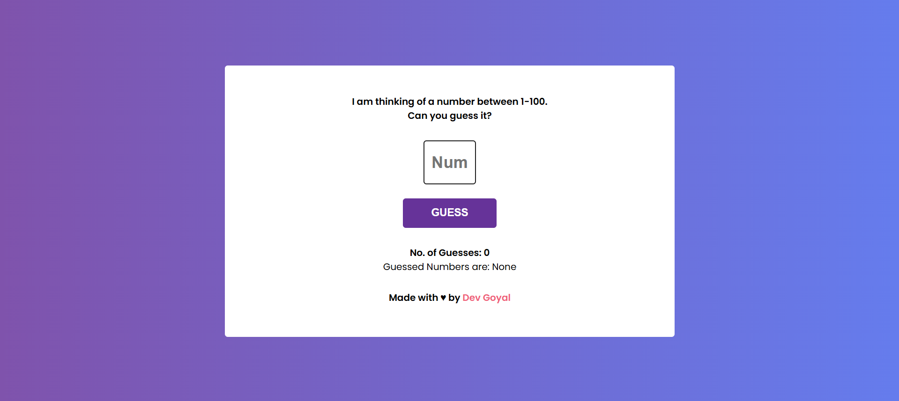

[](https://github.com/DevGoyalG)
[](https://github.com/DevGoyalG?tab=repositories)


<h1 align="center"> Number Guessing Game </h1>

<p align="center"> <b> If you found this repository helpful, give us a  ⭐️ </b> </p>
<p align="center"></a> </p>

A simple project where the user has to guess a random number between a specified range. The application will give hints whether the guess is too high or too low. This game is designed for ease of use and provides a fun experience. 

## 🌐 Live Demo
Check out the live demo of the Number Guessing Game [here](https://number-guess-play.netlify.app/).

## 📸 Project Preview
Here's a sneak peek of the Number Guessing Game:



## 🚀 Features
- The player has to guess a randomly generated number within a specified range.
- Instant feedback on whether the guessed number is too high or too low.
- Displays the number of attempts taken to guess correctly.
- Resets the game after a correct guess.

## 🛠️ Tech Stack
- **HTML** : For the structure of the game interface.
- **CSS** : For styling the page and making it interactive.
- **JavaScript** : For game logic, generating random numbers, and handling user inputs.

## 🧑‍💻 Getting Started

Follow the steps below to clone and use the project locally:

### 1. Prerequisites
Make sure you have **Git** installed. If not, you can download it [here](https://git-scm.com/).

### 2. Clone the Repository
```bash
git clone https://github.com/DevGoyalG/Number-Guessing-Game.git
```

## 🤝 Contributing
Contributions are welcome! If you have suggestions or want to report an issue, feel free to open an issue or create a pull request.

## 👨‍💻 Created by
This project was created and is maintained by:
**Dev Goyal**

Feel free to reach out if you have any questions or suggestions! ❤️
